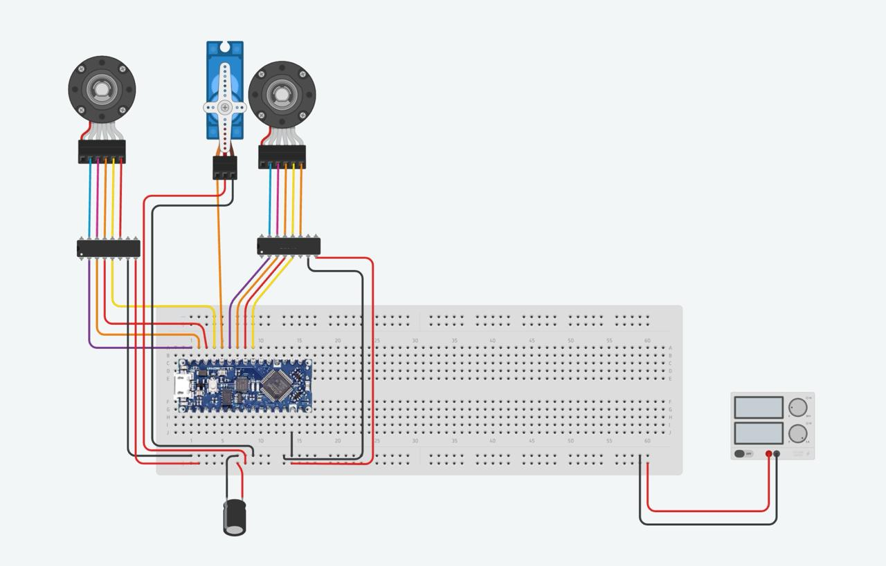
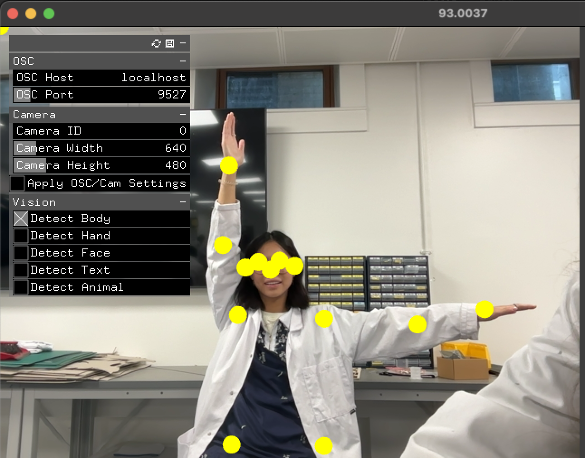

# *HMS Time* 
### Cyber-Physical Systems Project Documentation

###

## 1. Concept

The pendulum clock has long captured the passage of time in hours, minutes, and seconds with its steady rhythmic swing. Inspired by the intricate mechanics of clockwork and fascinated by the nature of time perception, we set out to play with an idea of time that transcends the mechanical. Instead of being represented through the ticking of a traditional clock that persists in the background, what if we had the ability to shape and guide our own experience of time?

Our project, HMS Time, reimagines the abstract notion of time as not only something ticking down, but a medium to be felt and navigated through. Its sculptural shape takes the form of a ship, motored by a set of gears, and invites kinetic interaction through a webcam that detects body position. Audience members manipulate the motion of the ship and gears by forming their arms into the 12, 3, and 9 o'clock positions, thus becoming the clock with their own bodies. 

## 2. Setup and Initialization Guide

### Processing

1. **Install Libraries**:
   - Ensure the `oscP5` and `netP5` libraries are installed in Processing for OSC communication. You can install these from the Processing IDE's Library Manager.

2. **Set Up Serial and OSC**:
   - Connect your Arduino to your computer and check which serial port it’s assigned to. Uncomment and modify the line `port = new Serial(this, Serial.list()[index], 115200);` to select the correct port (replace `index` with the correct number, e.g., `Serial.list()[0]`).
   - OSC setup (`oscP5 = new OscP5(this, 12000);`) should already match Wekinator's output port if you’re using it.

3. **Run the Sketch**:
   - Run the Processing sketch to begin receiving OSC messages from Wekinator and sending serial commands to Arduino based on recognized gestures.

### Arduino

1. **Install Servo Library**:
   - Ensure the `Servo.h` library is available in the Arduino IDE. This library comes pre-installed with the Arduino IDE but can be added from the Library Manager if necessary.

2. **Connect the Hardware**:
   - Connect the servo motor signal wire to Arduino pin 8.
   - Connect the stepper motors as follows:
     - **Stepper Motor 1**: Connect its four control pins to Arduino pins 9, 10, 11, and 12.
     - **Stepper Motor 2**: Connect its four control pins to Arduino pins 4, 5, 6, and 7.
   - Ensure each motor’s power requirements match your setup (use external power if needed).

3. **Upload the Code**:
   - Upload the Arduino code to your board. Ensure the Serial Monitor is closed if it conflicts with Processing’s serial connection.

4. **Run the System**:
   - With the Arduino code uploaded and Processing running, test the system by sending gestures from Wekinator to verify that commands activate the motors as expected.

### Wekinator and VisionOSC

1. **Install Wekinator**:
   - Download and install Wekinator from [wekinator.org/downloads](http://wekinator.org/downloads).
   - Launch Wekinator and load the provided project files for this setup. Ensure the output ports are set to match Processing’s listening port (12000).

2. **Install VisionOSC**:
   - Download and install VisionOSC, a computer vision tool that sends OSC data compatible with Wekinator.

3. **Set Up VisionOSC**:
   - Open VisionOSC and configure it to detect hand gestures. Set the output port to Wekinator’s input port (default is 6448).

4. **Run VisionOSC and Wekinator**:
   - Run both VisionOSC and Wekinator. VisionOSC will capture gestures and send OSC data to Wekinator for classification.
   - In Wekinator, open the provided project training files, and run the model. Wekinator will then send the classified gesture data to Processing.

## Code Overview and Functional Mapping

### Wekinator Defined Classes

- **Class 1**: Hands pointing to 12 o'clock (both arms raised upward).
- **Class 2**: Hands pointing to 9 o'clock (left arm pointed to the side, right arm raised upward).
- **Class 3**: Hands pointing to 3 o'clock  (right arm pointed to the side, left arm raised upward).
- **Class 4**: Hands do nothing (neutral, resting state).
- **Class 5**: Human back facing the camera (no hand gestures visible).

### Processing Code Functional Overview

This code facilitates a gesture recognition system that receives input from Wekinator, processes sequences, and sends specific outputs to control an Arduino-connected motor system. The key functionalities are:

1. **Receiving Input from Wekinator**:
   - The code listens for OSC messages from Wekinator, which recognizes hand gestures.
   - Each gesture is converted into a numerical input that is added to a sequence, representing the user’s recent gestures.

2. **Gesture Sequence Recognition**:
   - Sequences of gestures are matched against predefined patterns to determine specific commands:
     - Example sequences: `[1]`, `[1, 2]`, `[1, 2, 3]`, and `[1, 3, 2]`.
     - Each pattern triggers a different action, like starting a motor, activating a specific part, or reversing.

3. **Output and Communication with Arduino**:
   - Based on the recognized gesture sequence, a corresponding command is generated and sent to the Arduino.
   - For example:
     - A single gesture `[1]` could start a motor.
     - Sequence `[1, 2, 3]` could activate a secondary motor or execute a multi-step process.
   - If a stop gesture (5) is recognized, the sequence is reset to await new input.

4. **Real-Time Visualization**:
   - A simple on-screen display shows the current sequence of gestures, helping users understand the recognized pattern and see which actions are triggered.

### Arduino Code Functional Overview

This Arduino code is designed to control a system with two stepper motors and one servo motor based on commands received through serial communication. The main functionalities are:

1. **Setting Up the Motors**:
   - The code defines pins for two stepper motors and one servo motor. Each motor has specific pins associated with it, which are used to control their movements.

2. **Receiving Commands**:
   - The Arduino listens for serial input to receive commands from an external source (e.g., a Processing program).
   - Different commands (1, 2, 3, 4, and 5) are mapped to activate or deactivate each motor:
     - **Command 1**: Activates the servo motor.
     - **Command 2**: Activates the first stepper motor.
     - **Command 3**: Activates the second stepper motor.
     - **Command 4**: Changes the direction of the stepper motors.
     - **Command 5**: Stops all motors.

3. **Controlling the Servo Motor**:
   - The servo motor is programmed to move smoothly back and forth between 0 and 180 degrees.
   - It uses a non-blocking approach, which allows it to run without interrupting the stepper motors’ operations.

4. **Controlling the Stepper Motors**:
   - The code continuously checks if either of the two stepper motors is active.
   - When activated, each stepper motor completes a sequence of steps, with each step corresponding to a specific pattern of signals sent to the motor’s pins.
   - The motor direction can be changed with the `Direction` variable, allowing the stepper to move forward or backward.

5. **Direction and Step Management**:
   - The `SetDirection` function updates the stepping sequence based on the direction variable, making sure the motors rotate in the correct direction.
   - When a sequence completes or reaches a limit, the code resets the step count to loop back through the motion.

## 3.  Mechanical Design

Our mechanical design for _HMS Time_ started with the idea of showcasing the intricate mechanisms of a clock, particularly the energy transfer and gear interactions that drive a traditional timepiece. Mechanical clocks rely on stored energy, generated by winding the mainspring, which fuels the clock’s movement. Similarly, in our project, we sought to highlight these fundamental principles of clockwork: energy storage, gear-driven motion, and the counting of controlled intervals.

In a traditional clock, a mainspring’s energy turns a series of gears, converting high torque and low rotation (from winding) into a precise, low-torque, high-rotation movement that drives the clock hands. The gears count each rotation in carefully timed intervals, regulating the clock’s progression. By combining large and small gears, the rotation rate is controlled precisely, just as the folio arm in a clock’s escapement allows for incremental release of energy. We echo this concept in _HMS Time_, where each user gesture engages different components: moving the boat forward (12 o’clock) mirrors the advancing of time, engaging the gears (3 o’clock) simulates energy transfer, and shifting the hands (9 o’clock) reflects the measured pace of time’s flow.

To capture the elegance of these mechanisms, we opted for a rack and pinion system to drive the boat’s linear movement. This choice allows us to demonstrate the visible transformation of energy into motion, offering an immediate, hands-on interaction with the “clock” of _HMS Time_. The rack and pinion mechanism enables clear, linear movement that aligns with the experience of watching gears in motion, while also supporting the project’s aesthetic and functional goals, creating a more accessible interpretation of time as something that can be guided and observed.

  

_Rack and pinion mechanism_

## 4. Hardware Design 

**Components:**
* 2 Step Motors; 1 to control the gears and 1 to control the rack and pinion
* 2 Drivers; to provide the necessary power to drive the motor
* 1 Servo – to control the clock hands
* 1 Capacitor - Elcectrical Storage
* 1 Resistor - Electrical Resistance
* Unlimited Wires! – Connecting components to the breadboard
* Webcam – Wekinator input
* 4 x (5mm x 11mm x 5mm) bearings & shaft (5mm); used for smoothness in mechanical design when connected to the motor.

  
_Circuit diagram_

## 5. Machine Learning 

**Model Evaluation**

To classify user poses, we used **VisionOSC’s PoseOSC** to capture keypoint data in ARR format. Each pose generated a data array of 52 values representing the x, y coordinates and confidence scores for 17 keypoints. This data was sent to Wekinator, where we used a K-Nearest Neighbors (KNN) model to classify five distinct poses:

1. **12 o’clock** - both arms up
2. **3 o’clock** - right arm extended
3. **9 o’clock** - left arm extended
4. **Neutral** - arms at rest
5. **Back to camera**

  

_Example pose: 9 o'clock_

We trained the model with data from approximately 20 participants, providing a diverse dataset to improve recognition accuracy across different body types and poses.

We selected KNN for its simplicity and effectiveness in handling small datasets with clear, distinct classes. KNN performs well with lower-dimensional data, making it suitable for pose classification where each pose has distinct features based on keypoint positions. Compared to more complex models, KNN was computationally efficient and easier to tune, allowing faster real-time classification with minimal latency. 

**Opportunities for Improvement**

We could enhance the model’s robustness by expanding the dataset to include varied lighting conditions and more diverse participants. Higher-resolution keypoint tracking or integrating advanced pose estimation techniques could further improve classification accuracy.

## 6. Credits
* Shira Sonigo - coding, mechanism development, product design
* Carrie Rong - concept development & machine learning
* Moin Mulla - woodworking

Cyber Physical Systems  
October-November 2024  
Advisor Dr. Rebecca Stewart, Charlotte Slingsby  
MSc Innovation Design Engineering Dyson School of Design Engineering, Imperial College London

This module was funded by Design Education Trust
